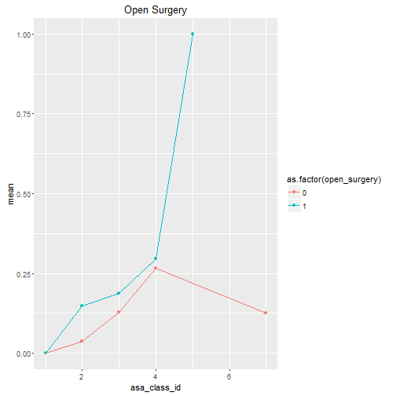
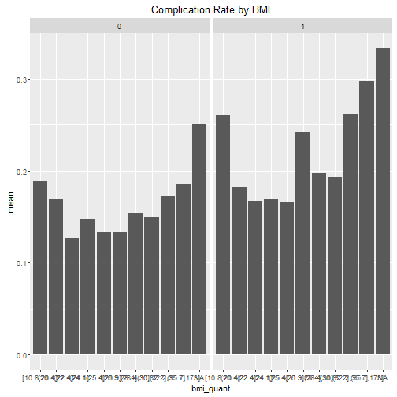
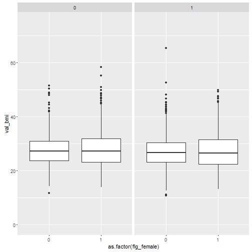
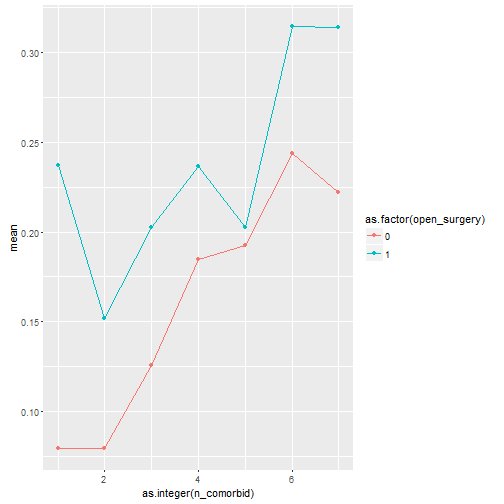
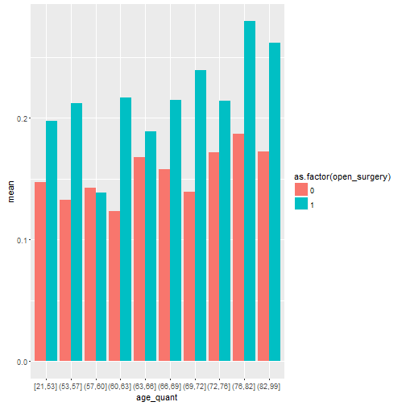
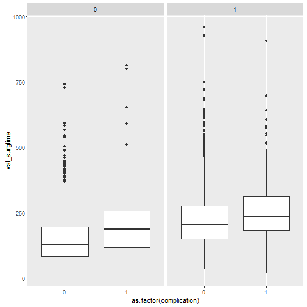

### Setup

```r
setwd("C:/Users/zkeller/Google Drive/stats_504/proj1")
require(readstata13)
require(readxl)
require(dplyr)

# Read in the data for msqc and our data dictionary
msqc <- read.dta13("procedure18.dta")
```

### Remove Columns with all NA or same Data

```r
# badcols records column numbers of bad columns
# i.e, columns with all NA or all the same value
badcols <- c()

# for loop to get bad column numbers
for(i in 1:ncol(msqc)){
  if(sum(!is.na(msqc[,i])) == 0){
    badcols <- c(badcols, i)    
  }
  if(sum(!(msqc[1,i] == msqc[-1, i]), na.rm=T) == 0 & !is.na(msqc[1,i])){
    badcols <- c(badcols, i)
  }
}

# remove the bad column numbers and any not followed up for 30 days
msqc <- msqc[msqc$flg_followed_30d == 1, -1*badcols]
```

### Code up our complication variable

```r
### Code up our complication variable

msqc$complication = as.numeric(msqc$death == 1 |msqc$death == 2| msqc$flg_dead30 == 1 |
                            msqc$flg_cmp_sev1 == 1 | msqc$flg_cmp_sev2 == 1 | msqc$flg_cmp_sev3 == 1 | 
                            msqc$flg_cmp_sepsis_severe == 1| msqc$flg_cmp_cardiac_arrest_any == 1 | 
                            msqc$flg_cmp_ssi_any == 1)

msqc <- msqc %>% filter(!is.na(complication) & !is.na(site_cid_160801))

# We will split into open vs not open surgeries later
# Create factor variable
msqc$open_surgery <- (msqc$e_surgical_approach == 1) * 1
msqc$open_surgery[(msqc$e_surgical_approach != 1) & (msqc$e_surgical_approach != 8) & (msqc$e_surgical_approach != 9)] <- NA
msqc <- msqc %>% filter(!is.na(complication) & !is.na(open_surgery))

# make a covariate for number of comorbidities
msqc$n_comorbid <- msqc$flg_cmb_cancer + 
  msqc$flg_cmb_bleeding_disorder + 
  msqc$flg_cmb_pvd + #peripheral artery disease
  msqc$flg_cmb_coronary_artery + # coronary artery disease
  msqc$flg_cmb_diabetes + # dieabeetus
  msqc$flg_cmb_copd + #chronic obstructive pulmonary disease
  msqc$flg_cmb_hypertension + #hypertension
  msqc$flg_cmb_dvt +# deep vein thrombosis
  msqc$flg_cmb_preop_sepsis + # preop sepsis
  msqc$flg_cmb_pneumonia + 
  msqc$flg_cmb_smoker + 
  msqc$flg_cmb_preop_transfusion + 
  msqc$flg_cmb_ventilator
```

### Some EDA

```r
library(dplyr)

## Looking at ASA score and complication
df <- msqc %>%
  group_by(open_surgery, asa_class_id) %>%
  summarize(n = n() - sum(is.na(complication)), mean = mean(complication, na.rm=T)) %>%
  filter(!is.na(open_surgery))
ggplot(df, aes(asa_class_id, mean, col = as.factor(open_surgery))) + geom_point() + geom_line() + ggtitle("Open Surgery")
```



```r
## Looking at bmi quantiles and complication
quants <- quantile(msqc$val_bmi, seq(0, 1, .10), na.rm=T)
bmi_quant_groups <- cut(msqc$val_bmi, unique(quants), include.lowest=T)
msqc$bmi_quant <- bmi_quant_groups
df <- msqc %>%
  group_by(open_surgery, bmi_quant) %>%
  summarize(n = n() - sum(is.na(complication)), mean = mean(complication))

  # Higher risk in very low and very high
ggplot(df, aes(y = mean,x = bmi_quant)) + geom_bar(stat = "identity") + ggtitle("Complication Rate by BMI") + facet_grid(. ~ open_surgery)
```



```r
ggplot(msqc, aes(x = as.factor(flg_female), y = val_bmi)) + geom_boxplot() + facet_grid(. ~ open_surgery) + ylim(0, 75)
```



```r
# Look at n comorbidities vs comp rate
df <- msqc %>% 
  group_by(open_surgery, n_comorbid) %>%
  summarize(n = n() - sum(is.na(complication)), mean = mean(complication))

ggplot(df %>% filter(n_comorbid < 8 & n_comorbid > 0), aes(as.integer(n_comorbid), mean, col = as.factor(open_surgery))) + geom_line() + geom_point()
```



```r
# Age vs comp rate
quants <- quantile(msqc$val_age, seq(0, 1, 0.1))
age_quant_groups <- cut(msqc$val_age, unique(quants), include.lowest = T)
msqc$age_quant <- age_quant_groups

df <- msqc %>%
  group_by(open_surgery, age_quant) %>%
  summarize(n = n() - sum(is.na(complication)), mean = mean(complication))

ggplot(df, aes(age_quant, mean, fill = as.factor(open_surgery))) + geom_bar(stat="identity", position = "dodge")
```



```r
# surgtime & comp
ggplot(msqc, aes(as.factor(complication), val_surgtime)) + geom_boxplot() + facet_grid(. ~ open_surgery)
```




### Create new variables to be used as covariates

```r
# create our new variables as covariates
msqc$flg_asa <- as.numeric(msqc$asa_class_id >= 4) 
msqc$high_comorbid <- msqc$n_comorbid > 5
```

### Split into open and closed datasets (to split analysis by surgical approach)

```r
msqc_open <- msqc[msqc$open_surgery == 1,]
msqc_closed <- msqc[msqc$open_surgery == 0,]
```

### Check Proportion of complication in each subset

```r
msqc_open_cmp_prop <- sum(msqc_open$complication, na.rm = T) / nrow(msqc_open)
msqc_closed_cmp_prop <- sum(msqc_closed$complication, na.rm = T) / nrow(msqc_closed)
```

## BEGIN COUNTERFACTUAL ANALYSIS
**Not Finished**


```r
# Filter for CIDs with > 25 operations
site_counts_open <- summary(as.factor(msqc_open$site_cid_160801))
open_cids <- names(site_counts_open)[site_counts_open >= 25]

site_counts_closed <- summary(as.factor(msqc_closed$site_cid_160801))
closed_cids <- names(site_counts_closed)[site_counts_closed >= 25]
```

## Create Dataframe for CF analysis, open data first

```r
open.cf.df <- data.frame(list("id" = open_cids, "n_complications" = rep(0, length(open_cids)), "n_predicted_comps" = rep(0, length(open_cids)), "fpr" = rep(0, length(open_cids)), "fnr" = rep(0, length(open_cids)), "tpr" = rep(0, length(open_cids)), "tnr" = rep(0, length(open_cids))), stringsAsFactors = F)


for (i in 1:nrow(open.cf.df)){
  temp.df <- msqc_open[msqc_open$site_cid_160801 == open.cf.df[i,1],]
  # browser()
  temp.model <- glm(complication ~ val_age + flg_asa + flg_female + high_comorbid + val_surgtime, temp.df, family=binomial(link = "logit"))
  tests <- msqc_open[msqc_open$site_cid_160801 != open.cf.df[i, 1],]
  pred_vals <- predict(temp.model, newdata = tests, type="response")
  flg_predicted_comps <- pred_vals > 0.5
  
  n_size <- nrow(tests)
  n_predicted_comps <- sum(flg_predicted_comps, na.rm=T)
  n_complications <- sum(tests$complication, na.rm=T)
  
  fpr <- sum(flg_predicted_comps & (!tests$complication), na.rm=T) / sum(!tests$complication, na.rm=T)
  tpr <- sum(flg_predicted_comps & tests$complication, na.rm=T) / sum(tests$complication, na.rm=T)
  tnr <- sum(!flg_predicted_comps & !tests$complication, na.rm=T) / sum(!tests$complication, na.rm=T)
  fnr <- sum((!flg_predicted_comps) & tests$complication, na.rm=T) / sum(tests$complication, na.rm=T)
  
  open.cf.df$n_complications[i] <- n_complications
  open.cf.df$n_predicted_comps[i] <- n_predicted_comps
  open.cf.df$fpr[i] <- fpr
  open.cf.df$tpr[i] <- tpr
  open.cf.df$tnr[i] <- tnr
  open.cf.df$fnr[i] <- fnr
}
```
